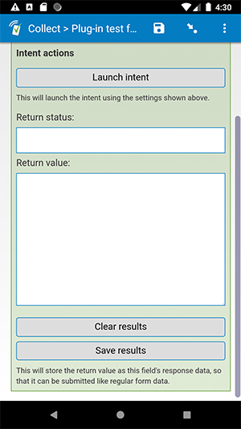

# feature-demo-intents

## Description

This field plug-in is meant to provide a generic way to test/debug intents in Android Collect.

*Note: this is not intended to be used to collect actual data. It is intended for demonstration/testing purposes.*

## How to use

1. Download the example form [extras/example-form](extras/example-form) from this repo and upload it to your SurveyCTO server.
1. Download the [feature-demo-intents.fieldplugin.zip](feature-demo-intents.fieldplugin.zip) file from this repo, and attach it to the example form on your SurveyCTO server.

## Required parameters

| Key | Value |
| --- | --- |
| `intentName` | The name of the intent to be called (example: `android.intent.action.SENDTO`) |
| `intentParams` | The parameters expected by that intent in a JSON string format (example: `{"param1":"123","param2":"456"}`) |

*Note: in the example form, both intentName and intentParams are stored in separate fields. The parameters passed to this field plug-in are just references to those other fields. This makes it easier during testing since the values that you are trying are saved and stored in the form data.*

## More resources

### In this repo

* **Example form**  
[extras/example-form](extras/example-form)

* **Test app**  
[extras/test-app](extras/test-app)  
This app can help you test how data is sent and returned through intents. If you install it on your device, you can call it using the intent name `com.surveycto.android.external.DUMMY` and pass any number of arbitrary parameters to it. Once you launch the intent, this dummy app will show the parameters that it received. You will then have the option to send a response *back* to SurveyCTO Collect.

### SurveyCTO Documentation

* **Developer documentation for field plug-ins**  
More instructions for developing field plug-ins.  
[https://github.com/surveycto/Field-plug-in-resources](https://github.com/surveycto/Field-plug-in-resources)

* **Developer documentation for using intents with SurveyCTO**  
Documentation for using intents with SurveyCTO Collect (without using field plug-ins)  
[https://support.surveycto.com/hc/en-us/articles/360033693033-Using-Android-intents](https://support.surveycto.com/hc/en-us/articles/360033693033-Using-Android-intents)

* **User documentation for field plug-ins**  
How to get started using field plug-ins in your SurveyCTO form.  
[https://docs.surveycto.com/02-designing-forms/03-advanced-topics/06.using-field-plug-ins.html](https://docs.surveycto.com/02-designing-forms/03-advanced-topics/06.using-field-plug-ins.html)

### Android Documentation

* **Developer guide for intents**  
[https://developer.android.com/guide/components/intents-filters.html](https://developer.android.com/guide/components/intents-filters.html)

* **Developer reference for intents**  
[https://developer.android.com/reference/android/content/Intent](https://developer.android.com/reference/android/content/Intent)
